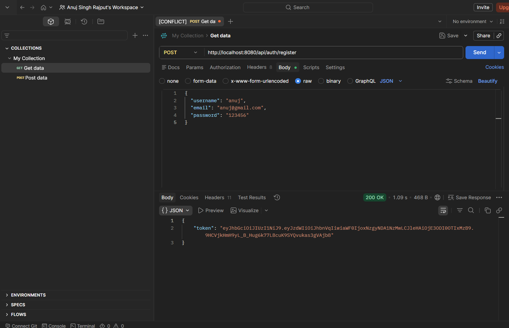
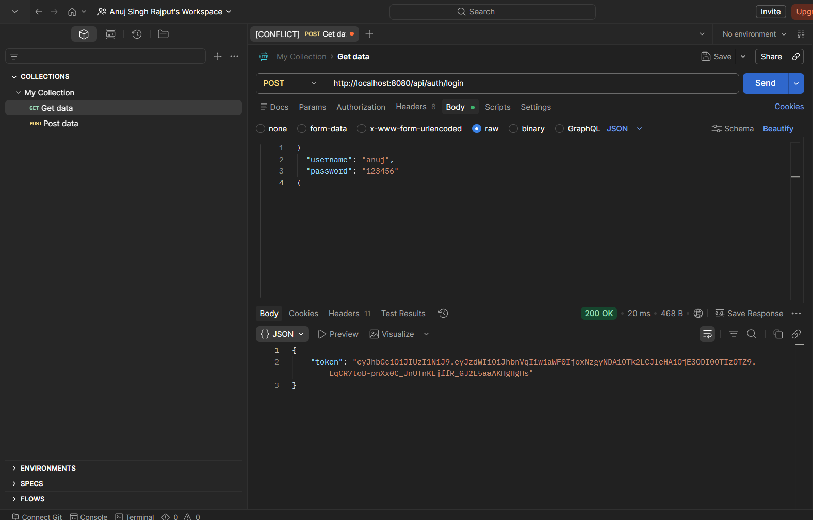
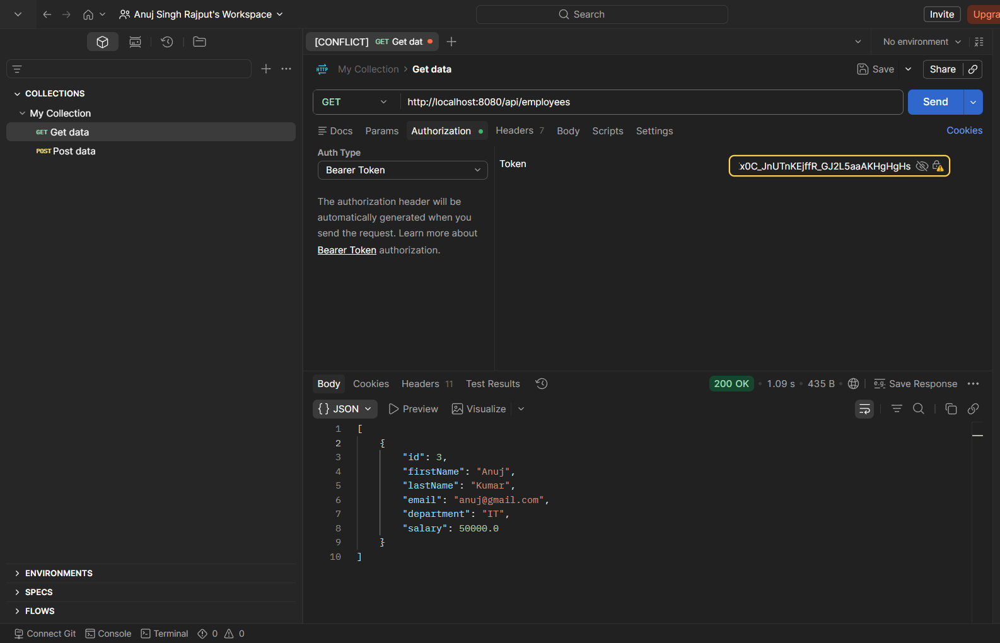
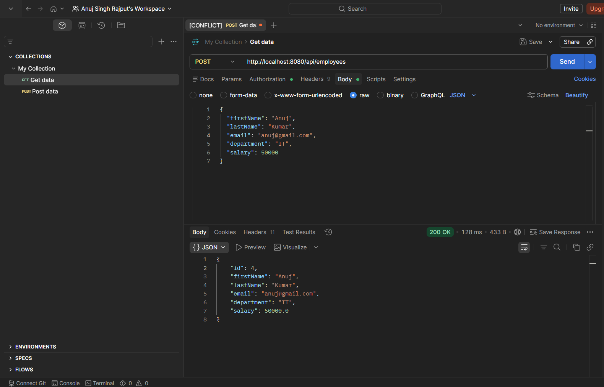
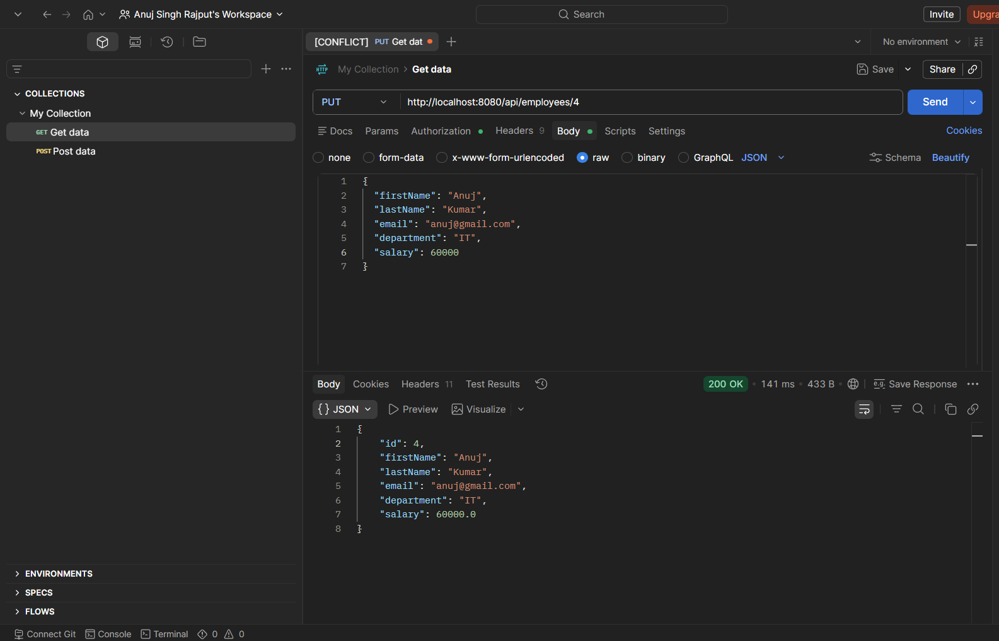
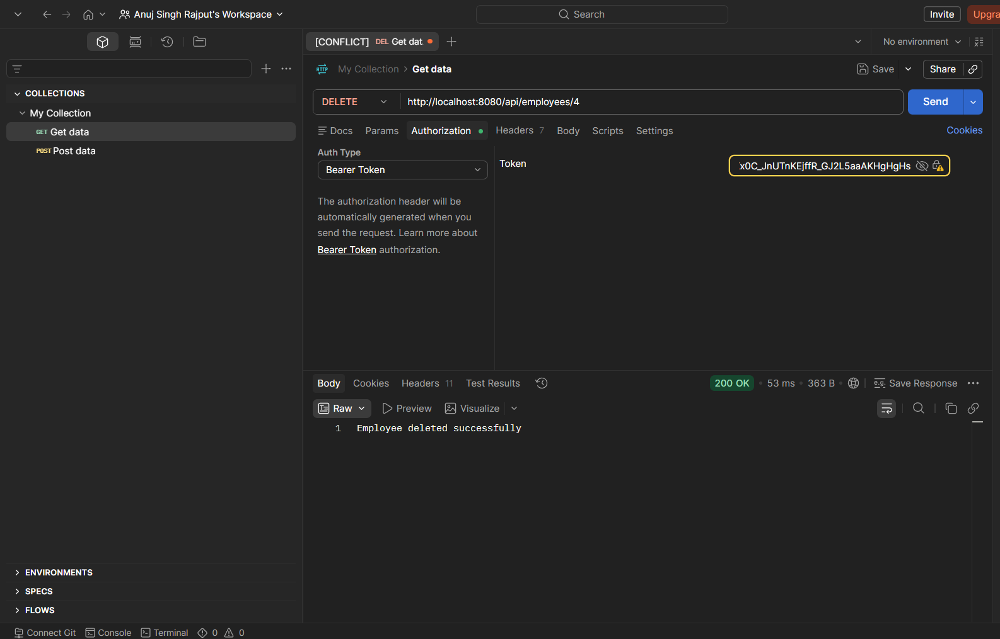

# Employee Management System with JWT Authentication

A secure Employee Management System built using Java, Spring Boot, Spring Security, JWT Authentication, Hibernate, JPA, and MySQL.

## Features

* User Registration
* User Login with JWT Authentication
* Secure REST APIs
* Create Employee
* Get All Employees
* Get Employee By ID
* Update Employee
* Delete Employee
* Spring Security Integration
* MySQL Database Connectivity

## Technologies Used

* Java
* Spring Boot
* Spring Security
* JWT (JSON Web Token)
* Spring Data JPA
* Hibernate
* MySQL
* Maven

## API Endpoints

### Authentication APIs

| Method | Endpoint           | Description   |
| ------ | ------------------ | ------------- |
| POST   | /api/auth/register | Register User |
| POST   | /api/auth/login    | Login User    |

### Employee APIs

| Method | Endpoint            | Description        |
| ------ | ------------------- | ------------------ |
| GET    | /api/employees      | Get All Employees  |
| GET    | /api/employees/{id} | Get Employee By ID |
| POST   | /api/employees      | Add Employee       |
| PUT    | /api/employees/{id} | Update Employee    |
| DELETE | /api/employees/{id} | Delete Employee    |

## Database

MySQL database is used for storing user and employee information.

## Author

Anuj Kumar

GitHub: https://github.com/anujsinghdev

## API Testing Screenshots

### Register User

### Login User

### Get All Employees

### Add Employee

### Update Employee

### Delete Employee
